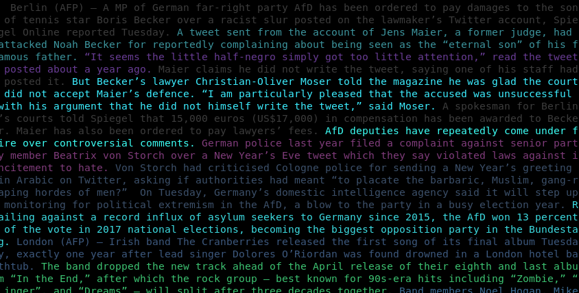

# bias
bias.py tokenizes a text file, then gives a sentiment polarity score (-1:1) to every word in the document. If any word has a score above or below 0, the variable **bias** = **bias + 1**. Once the for loop completes, bias.py divides **bias** by the total number of words in the document. The returned output represents the percentage of biased language in said *.txt, based on the python **textblob** package. 

sentiment_heatmap.py can be used for comparing sentences within a text by their relative sentiment polarity and subjectivity.

https://textblob.readthedocs.io/en/dev/quickstart.html#sentiment-analysis

# Setup

Install the dependencies listed in requirements.txt, e.g:
```bash
pip install -r requirements.txt
```

# Usage

## Bias
Call **bias.bias()** or execute bias.py with text file location as first argument. See some sample text files in **examples/** directory. Examples of usage:

```python
from bias import bias
with open("./examples/breitbart_short.txt", 'r') as infile:
    bias(infile)
```

```bash
python bias.py ./examples/economist.txt
```

## Sentiment heatmap

Call **sentiment_heatmap.get_heatmap()** with a text file object as argument to get a list of tuples of type `(s, pol, sub)`, where **s** is a **textblob.blob.Sentence**, **pol** is sentence's relative polarity, **sub** is sentence's relative subjectivity. E.g.:

```python
>>> from sentiment_heatmap import get_heatmap
>>> with open("./examples/breitbart_short.txt", "r") as f:
...     print(get_heatmap(f))
...
[(Sentence("  Berlin (AFP) – A MP of German far-right party AfD has been ordered to pay damages to the son of tennis star Boris Becker over a racist slur posted on the lawmaker’s Twitter account, Spiegel Online reported Tuesday."), 0.0, 0.0), (Sentence("A tweet sent from the account of Jens Maier, a former judge, had attacked Noah Becker for reportedly complaining about being seen as the “eternal son” of his famous father."), 0.45454545454545453, 0.5), (Sentence("“It seems the little half-negro simply got too little attention,” read the tweet posted about a year ago."), -0.22727272727272727, 0.4523809523809524)...
```
Execute sentiment heatmap.py with text file location as first argument to output the text with sente font tinted: Red color intensity representing the relative value of negative polarity, green color intensity -- relative value of positive polarity, blue color intensity -- relative value of subjectivity. E.g.:

```bash
python sentiment_heatmap.py ./examples/breitbart_short.txt
```

